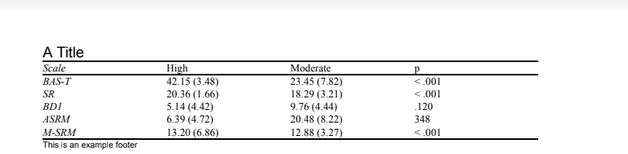

[](https://github.com/AidanCeney/RTFTable.jl)
# RTFTable

The `RTFTable` package provides a easy way to convert julia `DataFrames` into unique publication ready tables in the `rtf` format, with flexible formatting options. 

## Table Generation Workflow

Start by generating a `DataTable` struct by providing a `DataFrame` to  the `make_data_table()` function. 
```julia
    using DataFrames
    using RTFTable
	df = DataFrame(Scale=["BAS-T","SR","BD1","ASRM","M-SRM"],
	              High = ["42.15 (3.48)","20.36 (1.66)","5.14 (4.42)","6.39 (4.72)","13.20 (6.86)"],
				  Moderate = ["23.45 (7.82)","18.29 (3.21)","9.76 (4.44)","20.48 (8.22)","12.88 (3.27)"],
				  p = ["< .001","< .001",".120","348","< .001"])
	dt = RTFTable.make_data_table(df)
```

Next add formatting to your `DataTable`. 
+ With `set_font!` update the font for the table. 
+ Add cell borders with `set_borders!()`. 
+ Set the cells to have ittalic text with `set_italic`

```julia
	set_font!(dt,"Times")
 	set_borders!(dt,sides = ["t"],rows = 1)
    set_borders!(dt,sides = ["b"],rows = [1,6])
	set_italic!(dt,cols = 1)
```
Use the `rows` and `cols` arguments to select which cells of the table you wish to set. Note that when rows or columns are not provided to any `set_*` functions the entire row or column will be used. In the example all cells in the table had their font set to `Times` by not providing cols or rows.

### List of available format functions
+ merge_cols! 
+ set_cell_width!
+ set_borders!
+ set_font_size!
+ set_font!
+ set_font_color!
+ set_borders!
+ set_alignment!
+ set_bold!
+ set_italic!

After adding formatting you can add titles and footers to your table.

+ Add title with `add_title`
+ Add footer with `add_footer`

```julia	
	add_footer!(dt,"This is an example footer")
	add_title!(dt,"A Title")
```
Note that these functions will add new rows to your tables which can be formatted by using the formatting functions 

Once all settings have been set write the `DataTable` to a `rtf` file using the `write_table()` function. 
```julia
	write_table(dt,"example.rtf")
```

### Example Table



## Table Utils
### Table Properties
`RTFTable` implements the `Preferences` package to allow users to set default table settings by using the `set_property_default!()`. 

```julia
	set_property_default!("bold",true,"")
	set_property_default("font",true,"Times")
```
After the two setting default has been set to true all new `RTFTables` will have their cell's text bolded in the Times font.

### List of properties
 + left_border
 + left_border_width
 + right_border
 + right_border_width
 + top_border
 + top_border_width
 + bottom_border
 + bottom_border_width
 + left_align
 + center_align
 + right_align
 + bold
 + italic
 + fs (font size)
 + fontcolor
 + font

### Table Postprocessing 
In the case that there is a need to add unimplemented RTF table properties `RTFTable` has been designed to allow for easy post processing of the RTF Table. The basic text output of the table is stored in the `string_matrix` field of the `DataTable` struct. To manually update it after setting have been set run the `update_string_matrix!()` function. Once the `string_matrix` has been edited you can generate the `rtf` using the `write_table()` function with `update` argument set to `false`.

```julia
	update_string_matrix!(dt)
	dt.string_matrix[1][1][2] = "\\ql{\\fs28\\f1{A Title Edit!}}\\cell"
	write_table(dt,"example.rtf",update = false)
```

